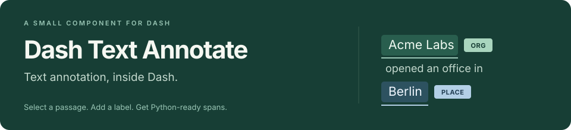

<p align="center">
  
</p>

<p align="center">
  <a href="pyproject.toml"></a>
  <a href="pyproject.toml"></a>
  <a href="LICENSE"></a>
</p>

<p align="center">
  <a href="#demo">Demo</a> · <a href="#quick-start">Quick start</a> · <a href="docs/reference.md">Component reference</a>
</p>

A small **text span annotation component for Dash**. Select a passage, assign a label, and receive structured annotations in Python callbacks. Source text stays intact, and everything runs inside your Dash app.

- Annotate with the mouse or keyboard.
- Use overlapping labels, passage badges, and undo/redo.
- Load and save annotations through ordinary Dash callbacks.

## Demo

<!-- Replace this comment with the GitHub-hosted MP4 URL on its own line.
Local upload files: upload-media/annotation-demo.mp4 and annotation-demo.gif.
The upload-media folder is intentionally ignored by Git and excluded from packages. -->

Try [the example app](usage.py): label a person and a date, undo, redo, and save. See the [quick start](#quick-start) to run it locally.

## Quick start

Requires **Python 3.10+** and **Dash 3 or 4**. JavaScript and CSS ship with the package; no Node.js or CDN is needed to use it.

> **0.1.0 is a breaking development release and is not yet published.** Install from this checkout. Upgrading from 0.0.1? Read the [migration guide](docs/migration.md).

```sh
# From this repository checkout:
python -m pip install .
python usage.py
```

Open <http://127.0.0.1:8050>. The demo includes session saving, JSON import/export, and read-only review. Save before switching documents; your own app can use a database or files instead of browser-session storage.

## A small app

```python
import json
from dash import Dash, Input, Output, html
from dash_text_annotate import DashTextAnnotate

app = Dash(__name__)
app.layout = html.Main([
    DashTextAnnotate(
        id="annotator",
        text="😀 Acme opened an office in Berlin.",
        tag="ORG",
        tag_colors={"ORG": "#79b9a5"},
        show_labels=True,  # Set False for highlights without passage badges.
        label_position="right",  # Also supports "left", "top", and "bottom".
        entities=[],
    ),
    html.Pre(id="annotations"),
])

@app.callback(Output("annotations", "children"), Input("annotator", "entities"))
def show_annotations(entities):
    return json.dumps(entities or [], ensure_ascii=False, indent=2)

if __name__ == "__main__":
    app.run(debug=True)
```

Selecting `Acme` produces a record like this:

```json
{"id": "a-stable-uuid", "start": 2, "end": 6, "text": "Acme", "tag": "ORG", "color": "#79b9a5"}
```

`text[start:end]` in Python is exactly the selected passage. Offsets are **zero-based Unicode code points; end is exclusive**. Combining marks count separately. Use `offset_unit="utf16"` for legacy JavaScript offsets, or migrate them with `convert_offsets`.

## Documentation

- [Component reference](docs/reference.md) — editing, keyboard controls, annotation data, and all properties.
- [Migration guide](docs/migration.md) and [changelog](CHANGELOG.md) — upgrading from 0.0.1.
- [Contributing](CONTRIBUTING.md) — local development, tests, and release checks.
- [Scope and alternatives](docs/ecosystem.md) — where this component fits.

The component handles plain-text annotation. Document storage, authentication, and collaboration belong to your app. Modern desktop browsers are the target; see the [validation record](docs/validation.md) for checks and limitations. Report bugs with a minimal Dash app, version details, and synthetic sample text.

## License

[MIT](LICENSE). Powered by [Recogito Text Annotator](https://github.com/recogito/text-annotator-js), using Dash's own React instance. Bundled libraries and their licenses are listed in [third-party notices](THIRD_PARTY_NOTICES.md). Thanks to the original `react-text-annotate` project and the Dash component tooling.
